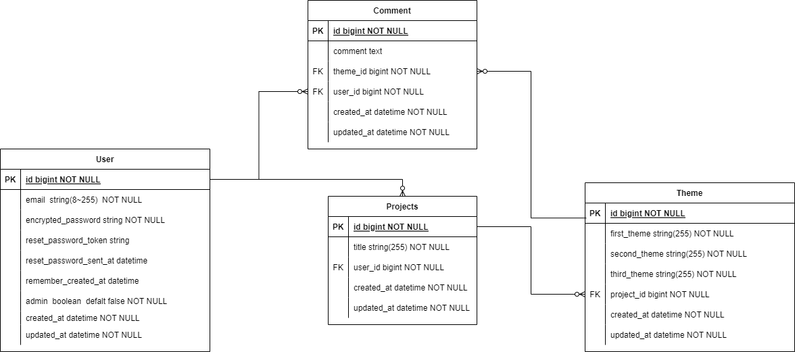
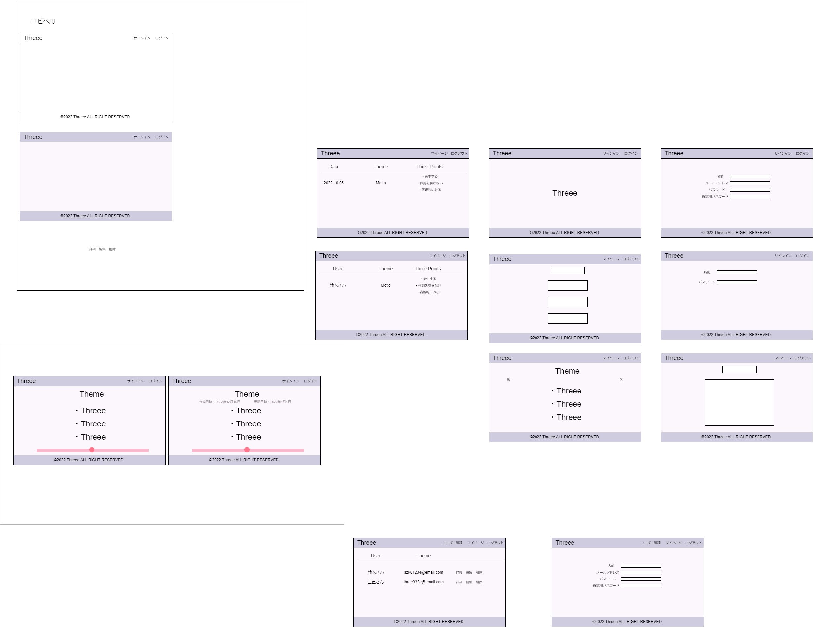
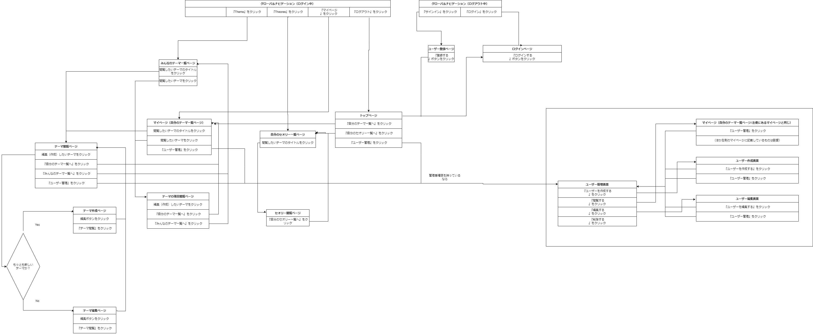

# README
## Threee

### このアプリできること
* 箇条書き編集機能
* ログイン機能
* 履歴閲覧機能

### 開発言語
* Ruby 3.0.1
* Ruby on Rails 6.1.6.1

### 就業Termの技術
* AWS デプロイ
* gem 'devise'

### カリキュラム外の技術
* Docker

### 実行手順
下記ターミナルにて実行

```
$ git clone git@github.com:tksotsk/threee_app.git
$ cd threee_app
$ bundle
$ rails db:create db:migrate
$ rails db:seed
```

### カタログ設計, テーブル設計
[カタログ設計](https://docs.google.com/spreadsheets/d/1I1Mqas3ASfcJlIj7kvU6YFLQU4QeYGiUhzhBrwdFyXM/edit#gid=782464957)

[テーブル設計](https://docs.google.com/spreadsheets/d/1I1Mqas3ASfcJlIj7kvU6YFLQU4QeYGiUhzhBrwdFyXM/edit#gid=2020033787)

### ER図　


### ワイヤーフレーム
draw.ioリンク



### 画面遷移図
draw.ioリンク

