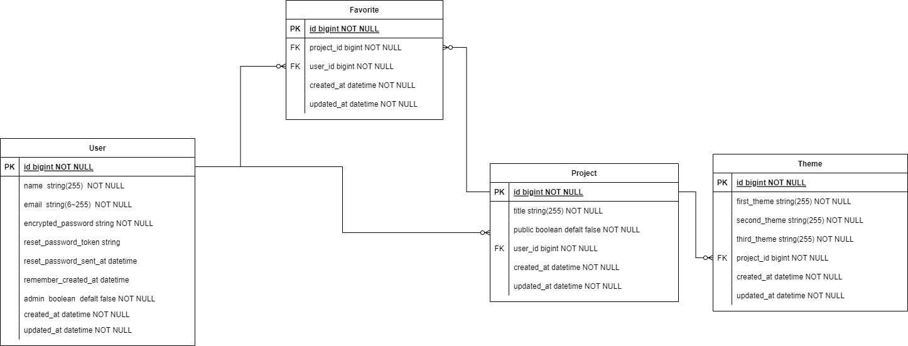
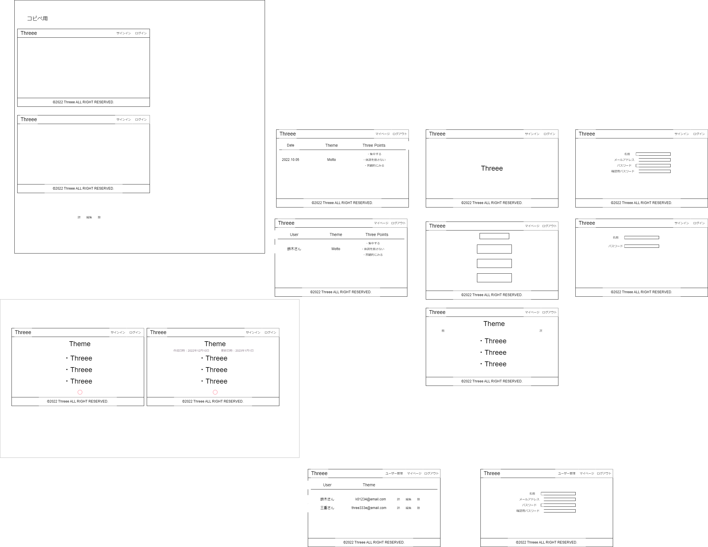
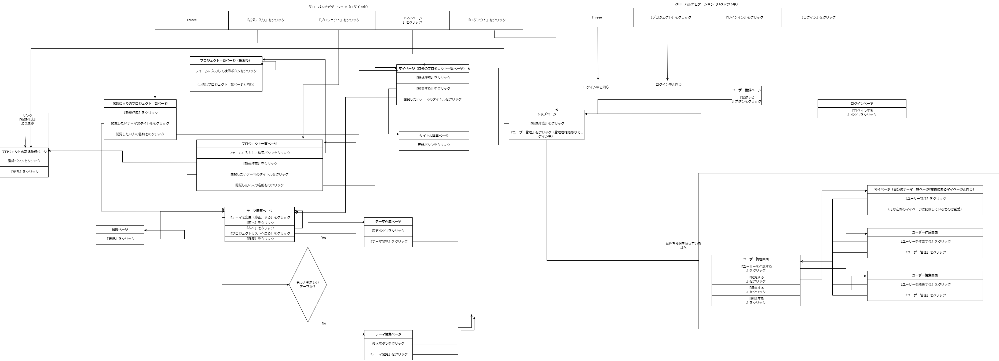

# README
## Threee

### 概要
今自分が気にしていたいテーマを３つ箇条書きにして書くアプリケーションです。

例えば、家事や作業、趣味など日ごろ自分が続けていることについて
自分でテーマを設定して作業中や作業後に思い出しやすくしてくれます。
テーマについて考え込むことよりも数をこなすことが重要だと考えて
3つのテーマに制限し、ユーザーからみてシンプルな設計をめざしました。
箇条書きを3つにすることには頭の中で意識できるようにする意図もあります。

ぜひ、このアプリケーションを使ってみてください


### このアプリできること
* 箇条書き編集機能
* ログイン機能
* 履歴閲覧機能
* お気に入り機能

### 開発言語
* Ruby 3.0.1
* Ruby on Rails 6.1.6.1

### 就業Termの技術
* AWS デプロイ
* gem 'devise'

### カリキュラム外の技術
* gem 'ransack'

### 実行手順
下記ターミナルにて実行

```
$ git clone git@github.com:tksotsk/threee_app.git
$ cd threee_app
$ bundle
$ rails db:create db:migrate
$ rails db:seed
```

### カタログ設計, テーブル設計
[カタログ設計](https://docs.google.com/spreadsheets/d/1I1Mqas3ASfcJlIj7kvU6YFLQU4QeYGiUhzhBrwdFyXM/edit#gid=782464957)

[テーブル設計](https://docs.google.com/spreadsheets/d/1I1Mqas3ASfcJlIj7kvU6YFLQU4QeYGiUhzhBrwdFyXM/edit#gid=2020033787)

### ER図　
[draw.ioリンク](https://app.diagrams.net/#G1pPakd0fUbVZ4UK1tV-YbZVPlK6bzi6IT)



### ワイヤーフレーム
[draw.ioリンク](https://app.diagrams.net/#G1q8UaTubNaPJ16_H5tyf_LQrpzCy8IiA9)



### 画面遷移図
[draw.ioリンク](https://app.diagrams.net/#G1rOA4HsE6aOyyyzVkuNktfGha3Ry7KlLi)

